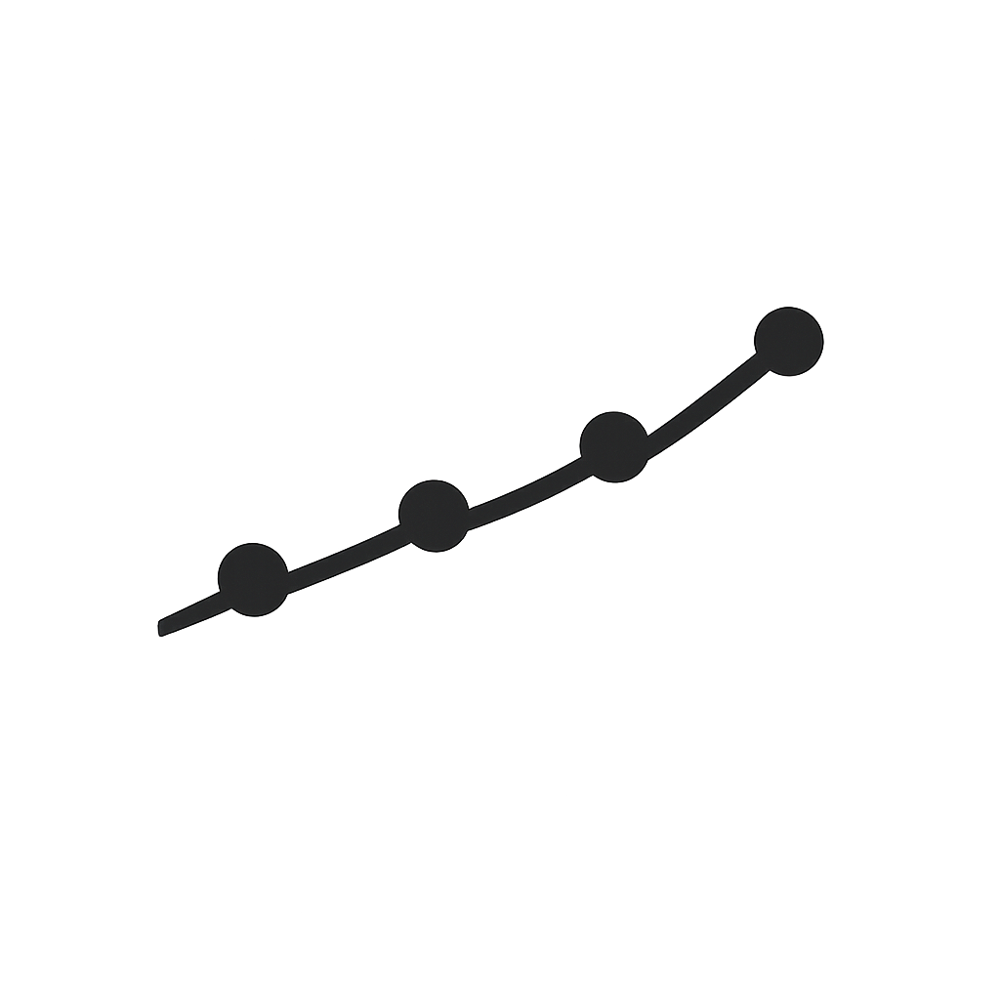

<p align="center"></p>

<h1 align="center">react-tiny-sparkline</h1>

<p align="center">
Tiny inline SVG sparkline charts for React. Line, area, bar, dot — with tooltips and animations. &lt;2KB gzipped. Zero dependencies.
</p>

<p align="center">
  <a href="https://www.npmjs.com/package/react-tiny-sparkline"></a>
  <a href="https://bundlephobia.com/package/react-tiny-sparkline"></a>
  <a href="https://github.com/mulkatz/react-tiny-sparkline/blob/main/LICENSE"></a>
</p>

<p align="center"></p>

<p align="center">
  <a href="https://react-tiny-sparkline.mulkatz.dev"><strong>→ Live Demo</strong></a>
</p>

## Features

- **4 variants** — line, area (gradient fill), bar, dot
- **Tooltips** — hover to see values
- **CSS animation** — smooth draw-in effect, respects `prefers-reduced-motion`
- **Min/max markers** — highlight lowest and highest points
- **Trend indicator** — arrow showing data direction (up/down/flat)
- **CSS Custom Properties** — `--sparkline-color`, `--sparkline-fill` for easy theming
- **Responsive** — SVG viewBox scales to any container
- **SSR-safe** — pure SVG, no `window` or `document` access
- **Tiny** — ~1.8KB gzipped, zero dependencies

## Install

```bash
npm install react-tiny-sparkline
```

## Quick Start

```tsx
import { Sparkline } from 'react-tiny-sparkline';

function Dashboard() {
  return (
    <Sparkline data={[3, 5, 2, 8, 4, 7, 1, 6]} />
  );
}
```

## Variants

```tsx
<Sparkline data={data} variant="line" />   // Default
<Sparkline data={data} variant="area" />   // With gradient fill
<Sparkline data={data} variant="bar" />    // Bar chart
<Sparkline data={data} variant="dot" />    // Dot plot
```

## Props

| Prop | Type | Default | Description |
|------|------|---------|-------------|
| `data` | `number[]` | required | Data points |
| `variant` | `'line' \| 'area' \| 'bar' \| 'dot'` | `'line'` | Chart variant |
| `width` | `number` | `100` | Width in px |
| `height` | `number` | `32` | Height in px |
| `color` | `string` | `'currentColor'` | Stroke/fill color |
| `fillColor` | `string` | — | Fill color for area variant |
| `strokeWidth` | `number` | `2` | Stroke width |
| `animate` | `boolean` | `true` | Animate on mount |
| `animationDuration` | `number` | `500` | Animation duration in ms |
| `showMinMax` | `boolean` | `false` | Show min (red) and max (green) markers |
| `showTrend` | `boolean` | `false` | Show trend arrow (↑↓→) |
| `tooltip` | `boolean` | `false` | Show value on hover |
| `formatTooltip` | `(value, index) => string` | — | Custom tooltip formatter |
| `curved` | `boolean` | `false` | Smooth curved line |
| `padding` | `number` | `2` | Internal padding |
| `barGap` | `number` | `0.2` | Gap ratio for bar variant (0-1) |
| `dotRadius` | `number` | `3` | Dot radius for dot variant |
| `className` | `string` | — | Additional CSS class |
| `style` | `CSSProperties` | — | Additional inline styles |
| `aria-label` | `string` | auto | Accessible label |

## Examples

### Dashboard stats

```tsx
<Sparkline
  data={[12, 15, 8, 22, 18, 25, 20]}
  variant="area"
  color="#6366f1"
  showTrend
  width={120}
  height={40}
/>
```

### Table inline chart

```tsx
<Sparkline
  data={revenue}
  variant="bar"
  color="#22c55e"
  width={80}
  height={24}
  animate={false}
/>
```

### With tooltips

```tsx
<Sparkline
  data={[100, 250, 180, 420, 310]}
  tooltip
  formatTooltip={(v) => `$${v}`}
  showMinMax
  curved
/>
```

## Theming

Customize via CSS Custom Properties:

```css
:root {
  --sparkline-color: #6366f1;
  --sparkline-fill: #6366f1;
  --sparkline-min: #ef4444;
  --sparkline-max: #22c55e;
  --sparkline-trend-up: #22c55e;
  --sparkline-trend-down: #ef4444;
  --sparkline-trend-flat: currentColor;
}
```

## Browser Support

Works in all modern browsers (Chrome 77+, Firefox 63+, Safari 13.1+, Edge 79+).

## License

MIT
